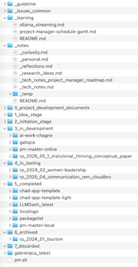

# PM Master Online

[Korean](README_KO.md) | [Chinese](README_ZH.md)

> **Network-accessible Personal Project Management System**

The online-accessible version of PM Master -- a database-free, filesystem-based all-in-one project management system accessible from any device on the network. Manages your `~/Projects/` folder structure as a fully managed project lifecycle with remote access capability.

PM Master Online manages a 7-stage lifecycle (Idea > Initiation > Development > Testing > Completed > Archived > Discarded) with kanban boards, per-project Gantt charts, 5-column todo boards, issue trackers, markdown editors, and an embedded terminal (xterm.js) that integrates directly with Claude Code for AI-driven workflows. It handles both research workflows (literature review, analysis, paper writing) and software development in a single interface, with Korean/English i18n and dark/light themes. Default ports: Backend 8002, Frontend 3002.

## Screenshots

| | | | |
|:---:|:---:|:---:|:---:|
|  |  |  |  |
| Dashboard Kanban | Ideas Cards | Ideas List View | Document Editor |
|  |  |  |  |
| Discussion Timeline | Server Control | People Cards (Dark) | Quick Note Panel |
|  |  |  |  |
| People Edit Modal | People Cards (Light) | Project Settings | Work Instructions |
|  |  |  |  |
| Todo Kanban | Issue Tracker | Schedule Table | Gantt Chart |
|  | | | |
| Local Folder Structure | | | |

## Features

### Dashboard
- Kanban board with 7-stage project lifecycle (Idea, Initiation, Development, Testing, Completed, Archived, Discarded)
- Drag-and-drop between stages with work instruction prompts
- Card/list view toggle with multi-column sorting
- Type filter with checkbox (Research, Development, Research+Development, Other)
- Card info: label, folder name, description, meta-tag icons, progress bar, target end date, related people
- Card actions on hover: edit, download (zip), delete (to trash)
- Active project summary with type-based counts (Research: N | Development: N | Other: N)

### Project Detail (6 Tabs)
- **Documents**: Markdown editor (@uiw/react-md-editor) with split view, folder drill-down with breadcrumb, new file/folder creation, multi-select delete, print/PDF export
- **Instructions**: Manual work instruction creation (text + custom checklist), auto-generated `docs/work_instruction_YYYY-MM-DD.md` on stage transition
- **Todo**: 3-column kanban (Todo / In Progress / Done), checkbox toggle, assignee, due date, priority badges, drag-and-drop between and within columns
- **Issues**: Thread-based issue tracker with status (Open/In Progress/Resolved/Closed), priority (Low~Critical), labels, filter counts, comment CRUD, inline editing
- **Schedule**: Table view + Gantt chart (CSS/SVG, no library), milestones with diamond markers, dependency arrows, category tracks with 30-color palette, responsive day width (1W/2W/3W/1M/All), today marker, overdue detection
- **Settings**: Project metadata (type, importance, severity, urgency, collaboration, owner), timeline & progress, subtask CRUD with drag reorder and progress bar

### Schedule / Gantt
- Task CRUD with assignee, dates, status, categories, dependencies
- Gantt chart with category tracks, dependency arrows, today line
- Milestones with diamond markers on gantt
- Parent task auto-date calculation from dependencies
- 30-color category palette with auto-assignment
- Duration calculation (inclusive start/end dates)
- Dependency enforcement: locked status when predecessors incomplete

### Header Summary Widgets
- Todo: done/total + progress bar + todo/wip counts
- Issues: open/total + open/done counts
- Schedule: planned/in_progress/done/overdue (real data)

### Sidebar Panels
- **Quick Note**: Instant memo to `_notes/_temp/`, organize into 5 categories (Research Ideas/Curiosity/Thoughts/Technical/Personal)
- **Work Execution**: Scan incomplete work instructions, launch Claude Code in embedded terminal (xterm.js + WebSocket PTY), auto-include "update checklist on completion" in prompt
- **Work Status**: Full project work status dashboard with per-project progress and checklist detail

### Ideas Page
- `1_idea_stage` projects in card grid
- Promote to Initiation (with work instruction modal)
- Discard to trash
- Create new idea (folder name / display name / description / type)

### Global Features
| Feature | Description |
|---------|-------------|
| People | Contact cards (name/org/role/expertise/relationship), connections, auto-generation from Related People |
| Trash | Restore (to 1_idea_stage) / Permanent delete |
| Server Control | start/stop/restart + log viewer (5s auto-refresh) |
| Discussion Timeline | Scan all project `_discussion.md` files, monthly grouping, chronological |
| Download | Project ZIP archive download |
| i18n | Korean/English toggle (280+ translation keys) |
| YAML Frontmatter | Standardized project metadata |
| New Project | Auto-creates folder + docs + `_idea_note.md` |
| Safe Move | Stop server -> move folder -> cleanup residuals |

### UI/UX
- Dark/light theme with `next-themes`
- In-app modal dialogs (no browser prompt/confirm)
- Markdown rendering with `@uiw/react-markdown-preview`
- Print/PDF export for documents
- Filter state persistence via localStorage

## Prerequisites

- **macOS** (uses `lsof` for port management)
- **Python 3.12+**
- **Node.js 18+**

## Quick Start

```bash
./setup.sh          # One-command setup (venv + npm install)
./run.sh start      # Start servers
```

Open http://localhost:3002 and log in with `admin` / `admin`.

## Installation on Another Machine

### 1. Create project folder structure

```bash
mkdir -p ~/Projects/{1_idea_stage,2_initiation_stage,3_in_development,4_in_testing,5_completed,6_archived,7_discarded,_notes,_learning,_issues_common}
```

### 2. Clone or copy the app

Place `project-manager-v2` anywhere on disk (e.g., inside `~/Projects/3_in_development/` or a separate directory).

### 3. Run setup

```bash
cd project-manager-v2
./setup.sh
./run.sh start
```

### 4. Custom project root (optional)

If your projects live somewhere other than `~/Projects`:

```bash
export PROJECTS_ROOT="/path/to/my/projects"
./run.sh start
```

### 5. Custom ports (optional)

Default: backend `8002`, frontend `3002`. To override:

```bash
echo "BACKEND_PORT=8010" > .run_ports
echo "FRONTEND_PORT=3010" >> .run_ports
```

Or the app auto-finds free ports if defaults are taken.

## Required Folder Structure

The app scans `~/Projects/` (or `$PROJECTS_ROOT`) for these stage folders:

```
~/Projects/
  1_idea_stage/           # Ideas and brainstorming
  2_initiation_stage/     # Initiated projects (Discussion)
  3_in_development/       # Active development
  4_in_testing/           # Testing / Analysis phase
  5_completed/            # Completed / Writing phase
  6_archived/             # Archived / Submitted
  7_discarded/            # Trash
  _notes/                 # Personal notes
  _learning/              # Learning logs
  _issues_common/         # Cross-project issue records
```

Each project is a subfolder within a stage folder. Projects are moved between stages via drag-and-drop or the move dialog.

## Data Storage

All app data is stored locally in `backend/data/`:

| Data | Path | Description |
|------|------|-------------|
| Schedules | `backend/data/schedules/*.json` | Gantt tasks, milestones, categories per project |
| Todos | `backend/data/todos/*.json` | Kanban todo items per project |
| Issues | `backend/data/issues/*.json` | Issue tracker per project |
| Subtasks | `backend/data/subtasks/*.json` | Project subtasks |
| Users | `backend/data/users.json` | Login accounts (bcrypt hashed) |
| Card order | `backend/data/card_order.json` | Dashboard kanban card positions |
| People | `backend/data/people.json` | People directory |

To migrate data to another machine, copy the `backend/data/` directory.

## Default Accounts

| Username | Password | Role |
|----------|----------|------|
| admin | admin | ADMIN |
| guest | guest | GUEST |

## Commands

```bash
./run.sh start      # Start backend + frontend
./run.sh stop       # Stop all servers
./run.sh restart    # Restart both servers
./run.sh status     # Check server status
./run.sh live       # Start + live log streaming
```

## Tech Stack

- **Backend**: Python 3.12 / FastAPI / JSON file storage
- **Frontend**: Next.js 15 (App Router) / React 19 / TailwindCSS / TypeScript
- **Auth**: bcrypt + file-based token (PyJWT)
- **Editor**: @uiw/react-md-editor
- **Markdown**: @uiw/react-markdown-preview
- **Terminal**: @xterm/xterm + WebSocket PTY
- **Icons**: Lucide React
- **Notifications**: react-hot-toast
- **Metadata**: YAML frontmatter (pyyaml)

## Architecture

```
project-manager-v2/
├── backend/
│   ├── main.py                     # FastAPI app + all endpoints
│   ├── services/
│   │   ├── scanner_service.py      # Project scanning and metadata
│   │   ├── schedule_service.py     # Schedule/gantt/milestone/category
│   │   ├── todo_service.py         # Todo kanban
│   │   ├── issue_service.py        # Issue tracker
│   │   ├── subtask_service.py      # Project subtasks
│   │   ├── document_service.py     # Document file management
│   │   ├── server_service.py       # Server control (run.sh)
│   │   ├── common_folder_service.py # Notes/learning/issues folders
│   │   ├── people_service.py       # People directory
│   │   └── auth_service.py         # JWT authentication
│   ├── data/                       # All JSON data (gitignored)
│   ├── requirements.txt
│   └── venv/
├── frontend/
│   ├── src/
│   │   ├── app/
│   │   │   ├── dashboard/          # Main dashboard
│   │   │   │   ├── page.tsx        # Kanban + list view
│   │   │   │   ├── ideas/          # Ideas management
│   │   │   │   ├── projects/       # Project list + detail
│   │   │   │   ├── [type]/         # Notes/learning/issues
│   │   │   │   ├── servers/        # Server status
│   │   │   │   ├── people/         # People directory
│   │   │   │   ├── timeline/       # Timeline view
│   │   │   │   └── trash/          # Discarded projects
│   │   │   └── layout.tsx
│   │   ├── components/
│   │   │   ├── AppDialogs.tsx      # ConfirmDialog, PromptDialog, NewProjectDialog
│   │   │   ├── Sidebar.tsx         # Navigation
│   │   │   ├── PageHeader.tsx      # Top header
│   │   │   ├── MoveProjectModal.tsx
│   │   │   ├── MetaTags.tsx        # Project meta badges
│   │   │   ├── ProgressBar.tsx     # Subtask progress
│   │   │   └── ...
│   │   └── lib/
│   │       ├── api.ts              # API client with auth
│   │       ├── stages.ts           # Stage configuration
│   │       ├── i18n.tsx            # Internationalization
│   │       └── useAuth.ts          # Auth hook
│   ├── package.json
│   └── next.config.ts
├── docs/
├── run.sh                          # Start/stop/restart/live
├── setup.sh                        # One-command installation
├── CHANGELOG.md
└── .gitignore
```

## Development

| Metric | Value |
|--------|-------|
| Development Period | 2026-03-19 ~ 2026-03-20 (~8.5 hours) |
| Total Code | 16,182 lines (43 files) |
| Frontend | 11,767 lines / TypeScript + React 19 |
| Backend | 4,415 lines / Python + FastAPI |
| Commits | 53 |
| AI Cost | ~$80-150 (Claude Opus 4) |
| Equivalent Manual Cost | ~$16,000 (320 hours @ $50/hr) |

### Evaluation

**Strengths**: Clear "filesystem as database" philosophy with zero migration overhead. High feature density — Kanban, Gantt, Issues, Todos, Documents, Server Control unified in one interface. Dual-purpose design supporting both academic research and software development workflows. Complete privacy with local JSON storage.

**Areas for Improvement**: Large component files (3,500+ lines) should be split into per-tab components. 50+ useState hooks per page would benefit from Zustand or Context. Empty catch blocks need categorized error handling. Zero test coverage needs pytest + Playwright for regression prevention.

For detailed evaluation and future roadmap, see [docs/evaluation-and-roadmap.md](docs/evaluation-and-roadmap.md).

## License

Copyright (c) chadchae
