# PM Master Online

[English](README.md) | [中文](README_ZH.md)

> **로컬 우선 개인 프로젝트 허브**

PM Master Online는 데이터베이스 없이 파일시스템과 직접 동기화하는 로컬 우선(local-first) 프로젝트 관리 도구입니다. `~/Projects/` 폴더 전체를 웹 브라우저에서 시각화하고 관리할 수 있으며, 폴더 구조 자체가 곧 프로젝트의 상태를 나타냅니다. 별도의 데이터베이스 서버를 설치하거나 클라우드 서비스에 가입할 필요가 없습니다. 모든 데이터는 로컬 JSON 파일로 저장되므로 개인 정보와 연구 데이터의 프라이버시가 완벽하게 보장됩니다.

이 도구의 핵심 철학은 "파일시스템이 곧 데이터"라는 원칙입니다. 프로젝트를 7단계 생애주기(아이디어 > 착수 > 개발 > 테스트 > 완료 > 보관 > 폐기)로 관리하며, 칸반 보드에서 드래그 앤 드롭으로 단계를 전환할 수 있습니다. 단계를 이동하면 실제 파일시스템의 폴더가 이동되고, 작업 지시서가 자동으로 생성됩니다. 이 방식은 프로젝트의 히스토리를 파일 시스템 수준에서 추적할 수 있게 해주며, Git과 같은 버전 관리 도구와도 자연스럽게 통합됩니다.

PM Master Online는 소프트웨어 개발과 학술 연구 워크플로를 하나의 인터페이스에서 동시에 지원하도록 설계되었습니다. 개발 프로젝트에서는 이슈 트래커, 할일 칸반, 간트 차트, 마크다운 문서 편집기를 활용할 수 있고, 연구 프로젝트에서는 문헌 검토, 데이터 분석, 논문 작성의 전 과정을 체계적으로 관리할 수 있습니다. 프로젝트 유형을 Research, Development, Research+Development, Other로 분류하여 각 유형에 맞는 워크플로를 적용할 수 있습니다.

특히 주목할 만한 기능은 Claude Code와의 통합입니다. 내장 터미널(xterm.js + WebSocket PTY)을 통해 작업 지시서 기반의 AI 지원 개발이 가능합니다. 미완료된 작업 지시서를 스캔하여 Claude Code에 직접 전달하고, 체크리스트 완료 시 자동으로 업데이트하는 프롬프트가 포함됩니다. 이를 통해 AI 기반 개발 워크플로를 프로젝트 관리와 긴밀하게 연동할 수 있습니다.

다크/라이트 테마를 지원하며, 대시보드는 4가지 테마 변형(A/B/C/D)을 제공합니다. 한국어/영어 국제화(280개 이상의 번역 키)를 지원하고, 문서의 인쇄/PDF/마크다운/CSV 내보내기가 가능합니다. 설치는 `./setup.sh && ./run.sh start` 한 줄이면 충분합니다. Python 가상환경 생성과 npm 패키지 설치가 자동으로 처리되며, 별도의 복잡한 설정 과정이 필요하지 않습니다.

기존의 프로젝트 관리 도구들은 대부분 클라우드 기반으로 동작하며, 데이터를 외부 서버에 저장합니다. 이는 연구 데이터나 기밀 프로젝트를 다루는 개인 개발자 및 연구자에게 프라이버시 우려를 야기합니다. PM Master Online는 이러한 문제를 근본적으로 해결합니다. 텔레메트리 데이터를 수집하지 않으며, 제3자 서비스에 의존하지 않고, 구독료도 없습니다. 데이터는 언제나 로컬 머신에 남아 있으며, 단순한 파일 복사만으로 백업과 마이그레이션이 가능합니다. 프로젝트 폴더 하나를 통째로 복사하면 모든 이력과 문서가 함께 이동합니다.

## 스크린샷

> 스크린샷 이미지는 `docs/screenshots/` 폴더에 위치합니다.

| | | | |
|:---:|:---:|:---:|:---:|
| 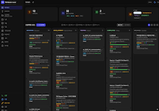 | 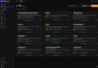 | 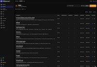 | 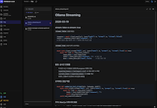 |
| 대시보드 칸반 (다크) | 아이디어 카드 | 아이디어 리스트뷰 | 문서 편집기 |
| 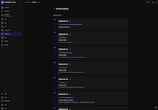 | 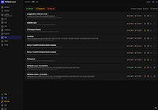 | 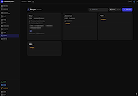 | 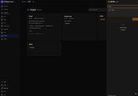 |
| 토의 타임라인 | 서버 관리 | 관계자 카드 (다크) | 빠른 메모 패널 |
| 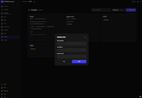 | 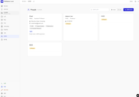 | 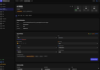 | 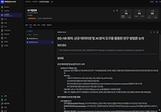 |
| 관계자 수정 모달 | 관계자 카드 (라이트) | 프로젝트 설정 | 작업지시서 |
| 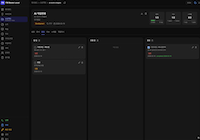 | 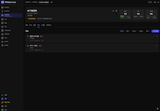 | 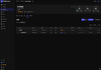 | 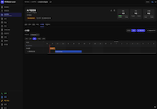 |
| 할일 칸반 | 이슈 트래커 | 스케줄 테이블 | 간트 차트 |

## 주요 기능

### 대시보드
- 7단계 프로젝트 생애주기 칸반 보드 (아이디어, 착수, 개발, 테스트, 완료, 보관, 폐기)
- 단계 간 드래그 앤 드롭 이동 시 작업 지시서 프롬프트 표시
- 카드/리스트 뷰 전환 및 다중 컬럼 정렬
- 유형별 필터 체크박스 (Research, Development, Research+Development, Other)
- 카드 정보: 라벨, 폴더명, 설명, 메타태그 아이콘, 진행률 바, 목표 종료일, 관련 인원
- 카드 호버 시 액션: 편집, 다운로드(zip), 삭제(휴지통으로 이동)
- 활성 프로젝트 요약 및 유형별 카운트 (Research: N | Development: N | Other: N)

### 프로젝트 상세 (6개 탭)
- **문서**: 마크다운 편집기 (@uiw/react-md-editor) 분할 뷰, 폴더 드릴다운 및 브레드크럼, 새 파일/폴더 생성, 다중 선택 삭제, 인쇄/PDF 내보내기
- **작업 지시서**: 수동 작업 지시서 생성 (텍스트 + 사용자 정의 체크리스트), 단계 전환 시 `docs/work_instruction_YYYY-MM-DD.md` 자동 생성
- **할일**: 3열 칸반 (할일 / 진행중 / 완료), 체크박스 토글, 담당자, 마감일, 우선순위 배지, 열 간/열 내 드래그 앤 드롭
- **이슈**: 스레드 기반 이슈 트래커, 상태 (Open/In Progress/Resolved/Closed), 우선순위 (Low~Critical), 라벨, 필터 카운트, 댓글 CRUD, 인라인 편집
- **일정**: 테이블 뷰 + 간트 차트 (CSS/SVG, 라이브러리 미사용), 마일스톤 다이아몬드 마커, 의존성 화살표, 30색 팔레트 카테고리 트랙, 반응형 일 너비 (1W/2W/3W/1M/All), 오늘 마커, 기한 초과 감지
- **설정**: 프로젝트 메타데이터 (유형, 중요도, 심각도, 긴급도, 협업, 소유자), 타임라인 및 진행률, 서브태스크 CRUD 및 드래그 정렬과 진행률 바

### 일정 / 간트
- 담당자, 날짜, 상태, 카테고리, 의존성을 포함한 태스크 CRUD
- 카테고리 트랙, 의존성 화살표, 오늘 표시선이 포함된 간트 차트
- 간트 차트 위 다이아몬드 마커로 표시되는 마일스톤
- 의존성 기반 상위 태스크 날짜 자동 계산
- 자동 할당되는 30색 카테고리 팔레트
- 기간 계산 (시작일/종료일 포함)
- 의존성 적용: 선행 태스크 미완료 시 상태 잠금

### 헤더 요약 위젯
- 할일: 완료/전체 + 진행률 바 + 할일/진행중 카운트
- 이슈: 오픈/전체 + 오픈/완료 카운트
- 일정: 계획/진행중/완료/기한초과 (실시간 데이터)

### 사이드바 패널
- **빠른 메모**: `_notes/_temp/`에 즉시 메모 저장, 5개 카테고리로 정리 (연구 아이디어/호기심/생각/기술/개인)
- **작업 실행**: 미완료 작업 지시서 스캔, 내장 터미널 (xterm.js + WebSocket PTY)에서 Claude Code 실행, 프롬프트에 "완료 시 체크리스트 업데이트" 자동 포함
- **작업 현황**: 전체 프로젝트 작업 현황 대시보드, 프로젝트별 진행률 및 체크리스트 상세

### 아이디어 페이지
- `1_idea_stage` 프로젝트를 카드 그리드로 표시
- 착수 단계로 승격 (작업 지시서 모달 표시)
- 휴지통으로 폐기
- 새 아이디어 생성 (폴더명 / 표시명 / 설명 / 유형)

### 전역 기능
| 기능 | 설명 |
|------|------|
| 인물 관리 | 연락처 카드 (이름/소속/역할/전문분야/관계), 연결 관계, 관련 인원에서 자동 생성 |
| 휴지통 | 복원 (1_idea_stage로) / 영구 삭제 |
| 서버 제어 | start/stop/restart + 로그 뷰어 (5초 자동 새로고침) |
| 토의 타임라인 | 모든 프로젝트의 `_discussion.md` 파일 스캔, 월별 그룹핑, 시간순 정렬 |
| 다운로드 | 프로젝트 ZIP 아카이브 다운로드 |
| 다국어 | 한국어/영어 전환 (280개 이상의 번역 키) |
| YAML Frontmatter | 표준화된 프로젝트 메타데이터 |
| 새 프로젝트 | 폴더 + docs + `_idea_note.md` 자동 생성 |
| 안전한 이동 | 서버 중지 -> 폴더 이동 -> 잔여 파일 정리 |

### UI/UX
- `next-themes` 기반 다크/라이트 테마와 4가지 대시보드 테마 변형 (A/B/C/D)
- 인앱 모달 다이얼로그 (브라우저 prompt/confirm 미사용)
- `@uiw/react-markdown-preview` 기반 마크다운 렌더링
- 문서 인쇄/PDF/마크다운/CSV 내보내기
- localStorage를 통한 필터 상태 유지

## 사전 요구사항

- **macOS** (포트 관리에 `lsof` 사용)
- **Python 3.12+**
- **Node.js 18+**

## 빠른 시작

```bash
./setup.sh          # 원커맨드 설치 (venv + npm install)
./run.sh start      # 서버 시작
```

http://localhost:3002 를 열고 `admin` / `admin`으로 로그인하세요.

## 다른 머신에 설치

### 1. 프로젝트 폴더 구조 생성

```bash
mkdir -p ~/Projects/{1_idea_stage,2_initiation_stage,3_in_development,4_in_testing,5_completed,6_archived,7_discarded,_notes,_learning,_issues_common}
```

### 2. 앱 복제 또는 복사

`project-manager-v2`를 디스크 어디에나 배치합니다 (예: `~/Projects/3_in_development/` 내부 또는 별도의 디렉토리).

### 3. 설치 실행

```bash
cd project-manager-v2
./setup.sh
./run.sh start
```

### 4. 사용자 정의 프로젝트 루트 (선택)

프로젝트가 `~/Projects` 이외의 경로에 있는 경우:

```bash
export PROJECTS_ROOT="/path/to/my/projects"
./run.sh start
```

### 5. 사용자 정의 포트 (선택)

기본값: 백엔드 `8002`, 프론트엔드 `3002`. 변경하려면:

```bash
echo "BACKEND_PORT=8010" > .run_ports
echo "FRONTEND_PORT=3010" >> .run_ports
```

기본 포트가 사용 중이면 앱이 자동으로 빈 포트를 찾습니다.

## 필수 폴더 구조

앱은 `~/Projects/` (또는 `$PROJECTS_ROOT`)에서 다음 단계 폴더를 스캔합니다:

```
~/Projects/
  1_idea_stage/           # 아이디어 및 브레인스토밍
  2_initiation_stage/     # 착수된 프로젝트 (토의)
  3_in_development/       # 활발한 개발 중
  4_in_testing/           # 테스트 / 분석 단계
  5_completed/            # 완료 / 작성 단계
  6_archived/             # 보관 / 제출됨
  7_discarded/            # 휴지통
  _notes/                 # 개인 메모
  _learning/              # 학습 기록
  _issues_common/         # 프로젝트 간 이슈 기록
```

각 프로젝트는 단계 폴더 내의 하위 폴더입니다. 프로젝트는 드래그 앤 드롭 또는 이동 다이얼로그를 통해 단계 간 이동됩니다.

## 데이터 저장소

모든 앱 데이터는 `backend/data/`에 로컬 저장됩니다:

| 데이터 | 경로 | 설명 |
|--------|------|------|
| 일정 | `backend/data/schedules/*.json` | 프로젝트별 간트 태스크, 마일스톤, 카테고리 |
| 할일 | `backend/data/todos/*.json` | 프로젝트별 칸반 할일 항목 |
| 이슈 | `backend/data/issues/*.json` | 프로젝트별 이슈 트래커 |
| 서브태스크 | `backend/data/subtasks/*.json` | 프로젝트 서브태스크 |
| 사용자 | `backend/data/users.json` | 로그인 계정 (bcrypt 해시) |
| 카드 순서 | `backend/data/card_order.json` | 대시보드 칸반 카드 위치 |
| 인물 | `backend/data/people.json` | 인물 디렉토리 |

다른 머신으로 데이터를 마이그레이션하려면 `backend/data/` 디렉토리를 복사하세요.

## 기본 계정

| 사용자명 | 비밀번호 | 역할 |
|----------|----------|------|
| admin | admin | ADMIN |
| guest | guest | GUEST |

## 명령어

```bash
./run.sh start      # 백엔드 + 프론트엔드 시작
./run.sh stop       # 모든 서버 중지
./run.sh restart    # 양쪽 서버 재시작
./run.sh status     # 서버 상태 확인
./run.sh live       # 시작 + 실시간 로그 스트리밍
```

## 기술 스택

- **Backend**: Python 3.12 / FastAPI / JSON 파일 저장
- **Frontend**: Next.js 15 (App Router) / React 19 / TailwindCSS / TypeScript
- **Auth**: bcrypt + 파일 기반 토큰 (PyJWT)
- **Editor**: @uiw/react-md-editor
- **Markdown**: @uiw/react-markdown-preview
- **Terminal**: @xterm/xterm + WebSocket PTY
- **Icons**: Lucide React
- **Notifications**: react-hot-toast
- **Metadata**: YAML frontmatter (pyyaml)

## 아키텍처

```
project-manager-v2/
├── backend/
│   ├── main.py                     # FastAPI 앱 + 전체 엔드포인트
│   ├── services/
│   │   ├── scanner_service.py      # 프로젝트 스캔 및 메타데이터
│   │   ├── schedule_service.py     # 일정/간트/마일스톤/카테고리
│   │   ├── todo_service.py         # 할일 칸반
│   │   ├── issue_service.py        # 이슈 트래커
│   │   ├── subtask_service.py      # 프로젝트 서브태스크
│   │   ├── document_service.py     # 문서 파일 관리
│   │   ├── server_service.py       # 서버 제어 (run.sh)
│   │   ├── common_folder_service.py # 메모/학습/이슈 폴더
│   │   ├── people_service.py       # 인물 디렉토리
│   │   └── auth_service.py         # JWT 인증
│   ├── data/                       # 전체 JSON 데이터 (gitignored)
│   ├── requirements.txt
│   └── venv/
├── frontend/
│   ├── src/
│   │   ├── app/
│   │   │   ├── dashboard/          # 메인 대시보드
│   │   │   │   ├── page.tsx        # 칸반 + 리스트 뷰
│   │   │   │   ├── ideas/          # 아이디어 관리
│   │   │   │   ├── projects/       # 프로젝트 목록 + 상세
│   │   │   │   ├── [type]/         # 메모/학습/이슈
│   │   │   │   ├── servers/        # 서버 상태
│   │   │   │   ├── people/         # 인물 디렉토리
│   │   │   │   ├── timeline/       # 타임라인 뷰
│   │   │   │   └── trash/          # 폐기된 프로젝트
│   │   │   └── layout.tsx
│   │   ├── components/
│   │   │   ├── AppDialogs.tsx      # ConfirmDialog, PromptDialog, NewProjectDialog
│   │   │   ├── Sidebar.tsx         # 네비게이션
│   │   │   ├── PageHeader.tsx      # 상단 헤더
│   │   │   ├── MoveProjectModal.tsx
│   │   │   ├── MetaTags.tsx        # 프로젝트 메타 배지
│   │   │   ├── ProgressBar.tsx     # 서브태스크 진행률
│   │   │   └── ...
│   │   └── lib/
│   │       ├── api.ts              # 인증 포함 API 클라이언트
│   │       ├── stages.ts           # 단계 설정
│   │       ├── i18n.tsx            # 국제화
│   │       └── useAuth.ts          # 인증 훅
│   ├── package.json
│   └── next.config.ts
├── docs/
├── run.sh                          # 시작/중지/재시작/라이브
├── setup.sh                        # 원커맨드 설치
├── CHANGELOG.md
└── .gitignore
```

## 라이선스

Copyright (c) chadchae
